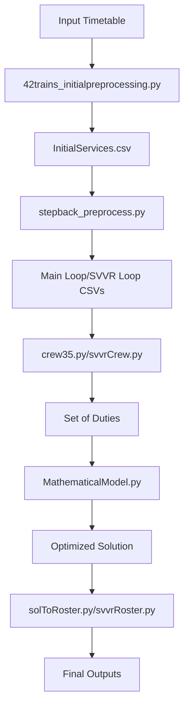

# Crew Scheduling Automation for DMRC

This repository contains a system to automate the generation of crew duty rosters for train operations for Line 7 (Pink Line) of Delhi Metro Rail Corporation. It uses mathematical modeling, preprocessing of operational data, and optimization algorithms to significantly reduce the time and effort required in manual crew scheduling.

---

## 📌 Project Overview
This system automates the complex process of crew scheduling for railway operations by:
- Processing timetable data into service segments
- Generating valid duty combinations that comply with operational rules
- Optimizing crew assignments using mathematical programming
- Producing comprehensive rosters and trip charts

While satisfying several operational constraints such as:
- Jurisdiction restrictions
- Step-back train logic
- Sign-on/off times and crew change rules
- Duty hour limitations
- Service continuity and rake handling

The system is built in modular Python scripts that handle different aspects of crew scheduling — from preprocessing raw data to generating optimal duty charts using mathematical programming.

---

## 📁 Folder Structure
```text
crew/
├── main.sh                     # Master execution script
├── 42trains_initialpreprocessing.py  # Timetable preprocessor
├── stepback_preprocess.py      # Step-back service processor
├── crew35.py                   # Main loop duty generator
├── svvrCrew.py                 # SVVR loop duty generator
├── MathematicalModel.py        # Optimization model
├── solToRoster.py              # Main loop output generator
├── svvrRoster.py               # SVVR loop output generator
├── jurisdiction.csv            # Crew control jurisdiction definitions
├── InputParameters.csv         # Operational parameters
├── requirements.txt            # Python dependencies
└── README.md                   # This file
```

---

## 🧮 Dependencies
- `pandas`
- `numpy`
- `matplotlib`
- `seaborn`
- `plotly`
- `pyomo`

Install the above dependencies before running:
```bash
pip install pandas numpy matplotlib plotly seaborn pyomo
```
You also need a solver supported by Pyomo like:
MIP (e.g., mbnb)

---

## Parameters Customization

### 1. `jurisdiction.csv`
This file defines operational boundaries and crew control stations. **Structure:**
- Line 1: CC1 Stations (comma-separated)
- Line 2: CC2 Stations (comma-separated)
- Line 3: Crew Control Stations (comma-separated)
- Line 4: SVVR Rake Numbers (comma-separated)

### 2. `InputParameters.csv`
Defines time constraints for duty scheduling:
| Parameter	          | Description	                         | Default  |
|-------------------------|--------------------------------------|----------|
| Duty_hours	          | Maximum duty duration	         | 445 mins |
| Driving_duration        | Maximum driving time per duty	 | 360 mins |
| Continuous_Driving_time | Max continuous driving without break | 180 mins |
| long_break	          | Minimum long break duration	         | 50 mins  |
| short_break	          | Minimum short break duration	 | 30 mins  |

---

## 🚀 How to Run
Each script has command-line arguments for flexible execution. Here's the general flow:

1. Preprocessing
```bash
 - python 42trains_initialpreprocessing.py <input_excel> <output_folder>
 - python stepback_preprocess.py <output_folder>
```
2. Generate Duties
```bash
 - python svvrCrew.py <preprocessed_file>
```
3. Optimize Duty Allocation
```bash
 - python MathematicalModel.py <input_file> <temp_folder>
```
4. Generate Final Roster
```bash
 - python solToRoster.py <input_file> <temp_folder> <output_folder>
```

You may also use the main.sh shell script to run the full pipeline.
```bash
bash main.sh <input_excel>
```
If you wanna push the task in the background then use:
```bash
nohup bash main.sh <input_excel> >log.txt 2>&1 &
```
Here `log.txt` stores the log or the output printed in the terminal of the above command.

---

## System Architecture


---

## 📊 Features
Automatic merging of compatible services (step-back and non-step-back)

Constraints-based duty generation

Uses optimization to minimize crew

Generates exportable CSV rosters and trip chart.

---

## 📃 License
This project is licensed under the terms of the LICENSE file.

---

## ✍️ Author
Rishuv Gorka
IIT Bombay | Crew Scheduling Automation | Delhi Metro Optimization

---
